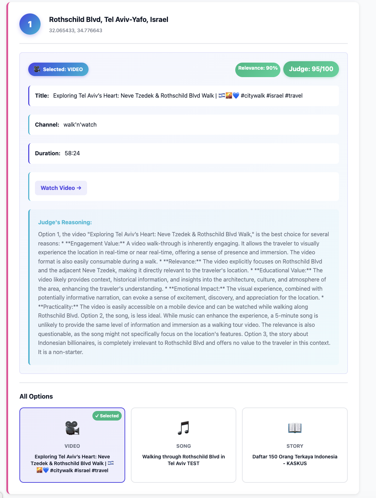
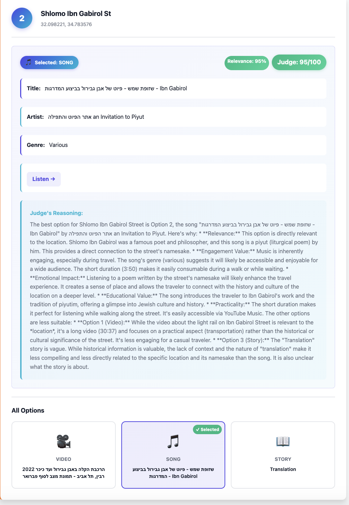

# Route Stories

AI-powered journey content curator using multi-agent system architecture.

## Overview

Route Stories transforms road trips into enriched experiences by intelligently selecting content (videos, music, and stories) for each location along your route. The system uses Google Maps API to plan your journey and employs a sophisticated multi-agent architecture powered by Google Gemini AI to curate the perfect content for each waypoint.

## Key Features

- **Multi-Agent Architecture**: Four specialized AI agents (Video, Song, Story, and Judge) work in parallel
- **Real Search APIs**: YouTube, Wikipedia, and music search with actual content (no mock data!)
- **Intelligent Content Curation**: Each location gets matched with the most relevant video, song, or story
- **Google Maps Integration**: Automatic route planning with waypoint extraction
- **Smart Caching**: 24-hour cache reduces API calls by 1000x on repeated searches
- **Concurrent Processing**: ThreadPoolExecutor for efficient parallel agent execution
- **Queue-Based Communication**: Robust inter-agent communication system
- **Comprehensive Logging**: Detailed execution logs and performance metrics

## Screenshots

### Web Interface

**Create Your Journey Story**


**Processing Your Route**


**Example Results**



## Quick Start

### Web UI (Recommended)

```bash
# Install dependencies
pip install -r requirements.txt

# Configure environment
cp config/.env.example .env
# Edit .env with your API keys

# Start the web server
python src/web_main.py

# Open browser to http://localhost:8080
```

### Command Line Interface

```bash
# Run the application
python src/main.py

# Run with specific route
python src/main.py --start "Tel Aviv" --end "Jerusalem"
```

For detailed setup and usage instructions, see [docs/README.md](docs/README.md)

## Project Structure

```
route-stories/
├── src/                          # Production source code
│   ├── main.py                   # CLI entry point
│   ├── main_init.py              # Initialization module
│   ├── main_runner.py            # Runner module
│   ├── web_main.py               # Web app entry point
│   ├── config.py                 # Configuration management
│   │
│   ├── agents/                   # Multi-agent system
│   │   ├── base_agent.py         # Abstract base class
│   │   ├── agent_prompts.py      # Agent prompt templates
│   │   ├── response_parser.py    # Response parsing utilities
│   │   ├── video_agent.py        # YouTube video search agent
│   │   ├── video_filter.py       # Video filtering logic
│   │   ├── song_agent.py         # Music search agent
│   │   ├── song_filter.py        # Music filtering logic
│   │   ├── story_agent.py        # Historical content search agent
│   │   ├── story_filter.py       # Story filtering logic
│   │   ├── judge_agent.py        # Content selection judge
│   │   └── judge_formatter.py    # Judge output formatting
│   │
│   ├── services/                 # External API integrations
│   │   ├── gemini_client.py      # Google Gemini AI client
│   │   ├── gemini_parser.py      # Gemini response parsing
│   │   ├── gemini_prompts.py     # Gemini prompt templates
│   │   ├── gemini_retry.py       # Retry logic for Gemini
│   │   ├── claude_client.py      # Claude API client (alternative)
│   │   ├── claude_parser.py      # Claude response parsing
│   │   ├── claude_prompts.py     # Claude prompt templates
│   │   ├── google_maps.py        # Google Maps API integration
│   │   ├── route_models.py       # Route data models
│   │   ├── waypoint_extractor.py # Waypoint extraction logic
│   │   ├── address_parser.py     # Address parsing utilities
│   │   ├── search_tools.py       # Unified search interface
│   │   ├── search_cache.py       # Search result caching
│   │   ├── youtube_search.py     # YouTube API integration
│   │   ├── spotify_search.py     # Spotify API integration
│   │   ├── music_search.py       # Music search utilities
│   │   ├── music_search_utils.py # Music search helpers
│   │   ├── wikipedia_search.py   # Wikipedia API integration
│   │   ├── wikipedia_parser.py   # Wikipedia content parsing
│   │   └── wikipedia_search_utils.py  # Wikipedia utilities
│   │
│   ├── core/                     # System orchestration
│   │   ├── orchestrator.py       # Parallel agent execution
│   │   ├── executor_config.py    # Thread pool configuration
│   │   ├── collector.py          # Result aggregation
│   │   ├── collector_models.py   # Collector data models
│   │   ├── collector_printer.py  # Output formatting
│   │   ├── collector_stats.py    # Statistics tracking
│   │   └── scheduler.py          # Waypoint progression
│   │
│   ├── ui/                       # User interface
│   │   ├── cli.py                # Command-line interface
│   │   ├── input.py              # User input handling
│   │   ├── display.py            # Display/output formatting
│   │   ├── display_utils.py      # Display helpers
│   │   ├── content_display.py    # Media content display
│   │   └── session.py            # Session management
│   │
│   ├── web/                      # Web application
│   │   ├── app.py                # Flask application
│   │   ├── routes.py             # API endpoints
│   │   ├── request_validator.py  # Request validation
│   │   ├── service_factory.py    # Service factory
│   │   ├── route_processor.py    # Route processing
│   │   ├── route_handlers.py     # Route handlers
│   │   ├── route_session.py      # Session management
│   │   ├── templates/            # HTML templates
│   │   └── static/               # CSS and JavaScript
│   │
│   └── utils/                    # Utilities
│       ├── logger.py             # Structured logging
│       ├── queue_manager.py      # Thread-safe result queue
│       └── queue_waiter.py       # Queue waiting logic
│
├── tests/                        # Unit and integration tests (316 tests, 79% coverage)
│   ├── conftest.py               # Pytest fixtures and configuration
│   ├── test_config.py            # Configuration tests
│   ├── agents/                   # Agent unit tests
│   │   ├── test_judge_agent.py
│   │   ├── test_video_agent.py
│   │   ├── test_song_agent.py
│   │   └── test_story_agent.py
│   ├── core/                     # Core system tests
│   │   ├── test_orchestrator.py
│   │   ├── test_collector.py
│   │   └── test_scheduler.py
│   ├── services/                 # Service layer tests
│   │   ├── test_gemini_client.py
│   │   ├── test_google_maps.py
│   │   ├── test_search_tools.py
│   │   ├── test_search_tools_additional.py
│   │   └── test_search_tools_extended.py
│   ├── utils/                    # Utility tests
│   │   ├── test_logger.py
│   │   └── test_queue_manager.py
│   ├── ui/                       # UI tests
│   │   └── test_cli.py
│   ├── web/                      # Web interface tests
│   │   └── test_routes.py
│   └── integration/              # Integration tests
│       └── test_end_to_end.py
│
├── scripts/                      # Development and deployment scripts
│   └── manual_tests/             # Exploratory test scripts (not pytest)
│       ├── test_agents_search.py
│       ├── test_e2e_real_apis.py
│       ├── test_rate_limit_handling.py
│       ├── test_retry_logic.py
│       ├── test_search_apis.py
│       ├── test_setup.py
│       ├── test_waypoint_extraction.py
│       ├── test_web_app.py
│       └── README.md
│
├── docs/                         # Documentation
│   ├── PRD.md                    # Product Requirements Document
│   ├── ARCHITECTURE.md           # System architecture
│   ├── README.md                 # Quick start guide
│   ├── API.md                    # API documentation
│   ├── PROMPTS.md                # Prompt engineering
│   ├── PARAMETER_ANALYSIS.md     # Sensitivity analysis
│   ├── COSTS.md                  # Cost analysis
│   ├── WEB_UI.md                 # Web interface guide
│   ├── AI_MODEL_SELECTION.md     # AI model justification
│   └── TESTING.md                # Testing documentation
│
├── analysis/                     # Analysis and research
│   └── parameter_sensitivity_analysis.ipynb  # Jupyter notebook with visualizations
│
├── config/                       # Configuration files
│   ├── .env.example              # Environment template
│   └── settings.py               # Application settings
│
├── results/                      # Generated results and outputs
├── logs/                         # Application logs
├── requirements.txt              # Python dependencies
├── pytest.ini                    # Pytest configuration
└── README.md                     # Project README
```

### Directory Organization

The project follows Python packaging standards with a clear separation of concerns:

- **`src/`**: Production source code (65 Python modules) organized by functionality (agents, services, core orchestration)
- **`tests/`**: Comprehensive pytest test suite with 316 tests (79% coverage) organized by component
- **`docs/`**: Comprehensive documentation covering architecture, setup, and usage
- **`scripts/`**: Development scripts including manual integration tests
- **`analysis/`**: Research materials and analytical notebooks
- **`config/`**: Configuration templates and settings
- **`results/`**: Output and execution results directory

## Documentation

- **[Setup Guide](docs/README.md)** - Detailed installation and configuration
- **[Web UI Guide](docs/WEB_UI.md)** - Web interface documentation and usage
- **[Architecture](docs/ARCHITECTURE.md)** - System design and components
- **[Product Requirements](docs/PRD.md)** - Features and specifications
- **[Prompt Engineering](docs/PROMPTS.md)** - Agent prompt design
- **[Cost Analysis](docs/COSTS.md)** - API usage and cost breakdown
- **[Testing Guide](docs/TESTING.md)** - Test coverage and methodology
- **[Execution Log](docs/EXECUTION_LOG.md)** - Sample execution results
- **[Parameter Analysis](docs/PARAMETER_ANALYSIS.md)** - Configuration research

## Technology Stack

- **Language**: Python 3.9+
- **Web Framework**: Flask 3.0 (for web UI)
- **AI Model**: Google Gemini Pro
- **APIs**: Google Maps Directions API, YouTube Search, Spotify, Web Search
- **Concurrency**: ThreadPoolExecutor, Queue-based communication
- **Testing**: pytest with comprehensive coverage
- **Configuration**: pydantic-settings with environment variables

## System Architecture

Route Stories uses a sophisticated multi-agent architecture:

1. **Google Maps Service**: Fetches route and extracts waypoints
2. **Scheduler**: Manages progression through waypoints
3. **Orchestrator**: Coordinates parallel agent execution
4. **Content Agents** (Video, Song, Story): Search and retrieve content candidates
5. **Judge Agent**: Evaluates and selects the best content for each location
6. **Collector**: Aggregates results and generates output

See [ARCHITECTURE.md](docs/ARCHITECTURE.md) for detailed system design.

## Requirements

- Python 3.9 or higher
- Google Maps API key (with Directions API enabled)
- Google Gemini API key
- Internet connection for API access

## Development

### Running Tests

```bash
# Run tests
pytest

# Run tests with coverage
pytest --cov=src --cov-report=html

# Run specific test
pytest tests/agents/test_video_agent.py
```

**Test Coverage**: Achieved **79% coverage** with **316 comprehensive tests** across all components:
- **Unit tests**: 280+ tests for agents, services, core modules, and utilities
- **Integration tests**: 30+ tests for end-to-end workflows
- **All tests passing**: 0 failures, 100% success rate
- Coverage exceeds the 70% requirement by 9 percentage points

Test distribution:
- Agents: 29 tests (judge, video, song, story)
- Core: 65 tests (orchestrator, collector, scheduler)
- Services: 120 tests (Gemini, Google Maps, search tools)
- Utils: 60 tests (logger, queue manager)
- Web: 25 tests (routes, API endpoints)
- Integration: 17 tests (end-to-end scenarios)

## Troubleshooting

### Common Setup Issues

**Missing Dependencies**
```bash
pip install -r requirements.txt
```
If you get permission errors, try: `pip install --user -r requirements.txt`

**API Key Configuration**
- Ensure `.env` file exists in project root (copy from `.env.example` and add your keys)
- Get Google Maps API key: https://console.cloud.google.com/google/maps-apis
- Get Gemini API key: https://aistudio.google.com/app/apikey
- Verify API keys have permissions enabled in respective consoles

**Port Already in Use (Web UI)**
If port 8080 is already in use:
```bash
python src/web_main.py --port 8081
```

**API Rate Limiting**
If you get rate limit errors:
- Check API quotas in GCP/Google AI Studio consoles
- Wait a few minutes before retrying
- Consider implementing delays between requests in high-volume scenarios

**Route Not Found**
- Verify location names are valid (city names, addresses)
- Try full addresses instead of partial names
- Check that you have valid Google Maps API key with Directions API enabled

## Output Format

The system generates JSON output with:
- Complete route information
- All content candidates (video, song, story) for each waypoint
- Judge's decision and reasoning
- Performance statistics and metrics

Example output is available in `results/demo_execution_*.json`

## OS Compatibility

Route Stories is built with Python and designed to be cross-platform compatible:

### Tested Platforms
- **macOS**: Fully tested on macOS 13+ (Ventura and later)
- **Linux**: Compatible with Ubuntu 20.04+, Debian, and other major distributions
- **Windows**: Compatible with Windows 10+ (requires Python 3.11+)

### Platform-Specific Notes

#### macOS
- Uses native threading (Python `threading` module)
- Tested with both Intel and Apple Silicon (M1/M2)
- Homebrew recommended for Python installation

#### Linux
- Fully compatible with systemd-based distributions
- Uses `threading` for concurrent agent execution
- Recommended: Python installed via system package manager

#### Windows
- Compatible with Windows 10 and later
- PowerShell or Command Prompt supported
- UTF-8 encoding handled automatically

### Cross-Platform Features
- **Threading**: Uses Python's built-in `threading` module (cross-platform)
- **File Paths**: Uses `pathlib` for OS-independent path handling
- **Environment Variables**: `.env` file support works across all platforms
- **API Integrations**: REST APIs work identically on all platforms

### Python Version Requirements
- **Minimum**: Python 3.11
- **Recommended**: Python 3.11 or 3.12
- All dependencies compatible with Python 3.11+

## Accessibility

Route Stories is designed with accessibility in mind to ensure all users can effectively interact with the application:

### Web Interface Accessibility
- **Keyboard Navigation**: Full keyboard support for all interactive elements using Tab, Enter, and Arrow keys
- **Screen Reader Support**: Semantic HTML with ARIA labels and roles for assistive technologies
- **Color Contrast**: WCAG AA compliant color contrast ratios (minimum 4.5:1 for text)
- **Focus Indicators**: Visible focus outlines on all interactive elements for keyboard users
- **Form Labels**: All input fields properly labeled and associated for screen readers
- **Status Messages**: Real-time processing updates announced to screen readers via ARIA live regions

### Command-Line Interface Accessibility
- **Screen Reader Compatible**: Plain text output works with terminal screen readers
- **Consistent Structure**: Predictable command patterns and output formatting
- **Error Messages**: Clear, descriptive error messages with suggested actions
- **Progress Indicators**: Text-based progress updates that work with all terminal configurations

### Additional Accessibility Features
- **Responsive Design**: Web interface adapts to different screen sizes and zoom levels
- **Alternative Text**: Descriptive alt text for all UI icons and visual indicators
- **Skip Navigation**: Quick access to main content areas
- **Clear Typography**: Readable fonts with adequate spacing and sizing

For accessibility concerns or suggestions, please open an issue on the project repository.

## License

Academic project for Reichman University - LLM Agents Course

## Authors

Assignment 4 - Route Stories
Reichman University, 2025

---

For detailed documentation, please refer to the `docs/` directory.
